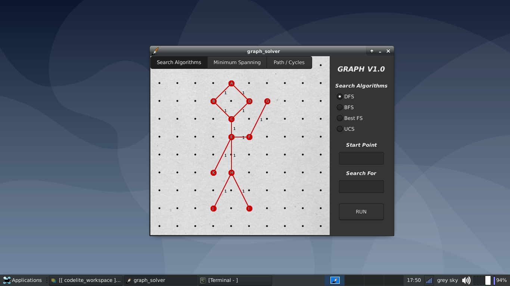

# graph_solver
It is a graph designer and solver written in C language.

Can apply for search algorithms  
1.DFS (Depth First Search)  
2.BFS (Breadth First Search)  
3.Best First Search  
4.UCS (Uniform Cost Search)  

Can apply for minimum spanning tree algorithms  
1.Kruskal's algorithm  
2.Boruvka's algorithm  
3.Prim's algorithm  
4.Reverse delete algorithm  

Can find bridges on the graph

Will apply for eulerian and hamiltonian path finding algorithms  
1.Fleury's algorithm (Still working on it)  
2.The nearest neighbour algorithm (Still working on it)  

What can't it do  
1.Doesn't support directed graphs  
2.Does support only one letter labels (not numerics or words)  
2.Doesn't support graphs that has degree of 53 or greater (Labeling problem)  

